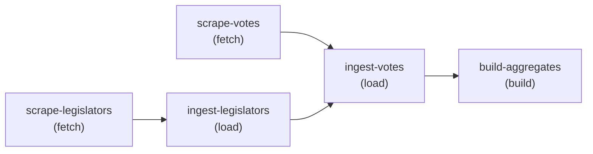

<!-- AUTO-GENERATED — do not edit. Source of truth: ingester/pipeline.manifest.js.
     Re-run: npm run generate-pipeline-docs (in us-congress/ingester). -->

# Ingestion pipeline

The pipeline DAG, generated from `ingester/pipeline.manifest.js`. Each node is one
cron-triggered stage; edges are `upstream[]` dependencies, enforced at runtime by
cursor readiness gates rather than by the cron schedule.

## Nodes

| Node | Stage | Domain | Cron | Readiness gate | Reads | Writes | Watermark | Idempotency |
| --- | --- | --- | --- | --- | --- | --- | --- | --- |
| `scrape-votes` | fetch | votes | `35 * * * *` (scraper/scrape_cron) | — (producer) | `external:House/Senate roll-call vote feeds (unitedstates/congress usc-run)` | `file:data/{congress}/votes/{session}/{chamber}{number}/data.json` `table:source_state` | `source_state` (source_name='congress-votes', stage='fetch') — advances to now() via write-fetch-cursor.sh, &&-gated on scrape success | scrape output is a file tree keyed by vote id; cursor write is INSERT … ON CONFLICT (source_name, stage) DO UPDATE |
| `ingest-votes` | load | votes | `50 * * * *` (ingester/ingest_cron) | runs iff source_state fetch.cursor > load.cursor for 'congress-votes' (loadReadiness) | `file:data/{congress}/votes/{session}/{chamber}{number}/data.json` `table:legislators` `table:votes` `table:source_state` | `table:votes` `table:vote_positions` `table:bills` `table:ingestion_runs` `table:source_state` | `source_state` (source_name='congress-votes', stage='load') — advances to the fetch cursor captured at run start, atomically with the ingestion_runs success row | votes ON CONFLICT (vote_id) DO UPDATE; bills ON CONFLICT DO NOTHING; positions DELETE+re-INSERT per vote; per-file skip when source_updated_at is current |
| `build-aggregates` | build | votes | `55 * * * *` (ingester/ingest_cron) | staleness self-gate: rebuilds each congress where max(votes.updated_at) > built_through | `table:votes` `table:vote_positions` `table:vote_similarity_state` | `table:vote_similarity` `table:member_party_agreement` `table:vote_similarity_state` `table:ingestion_runs` | `vote_similarity_state` (congress) — advances to max(votes.updated_at), in SQL inside the REPEATABLE READ rebuild transaction | per-congress DELETE + rebuild of both aggregate tables and the watermark, in one transaction |
| `scrape-legislators` | fetch | legislators | `0 2 * * *` (scraper/scrape_cron) | — (producer) | `external:unitedstates/congress-legislators git repo` | `file:data/legislators/*.yaml` `table:source_state` | `source_state` (source_name='congress-legislators', stage='fetch') — advances to now() via write-fetch-cursor.sh, after a successful sync (set -e) | sync is a git clone/pull --ff-only; cursor write is INSERT … ON CONFLICT (source_name, stage) DO UPDATE |
| `ingest-legislators` | load | legislators | `15 2 * * *` (ingester/ingest_cron) | runs iff source_state fetch.cursor > load.cursor for 'congress-legislators' (loadReadiness) | `file:data/legislators/legislators-current.yaml` `file:data/legislators/legislators-historical.yaml` `table:source_state` | `table:legislators` `table:legislator_terms` `table:ingestion_runs` `table:source_state` | `source_state` (source_name='congress-legislators', stage='load') — advances to the fetch cursor captured at run start, atomically with the ingestion_runs success row | legislators ON CONFLICT (bioguide_id) DO UPDATE; terms DELETE+re-INSERT per legislator |
