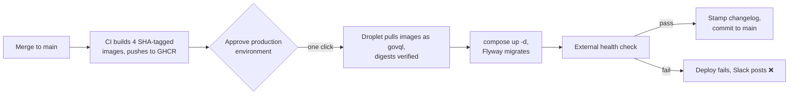

# Votes

US Senate and House roll call vote data, served as a GraphQL API via PostGraphile v5.

## Prerequisites

- [dotenvx](https://dotenvx.com/docs/install) for secret management
- Docker Desktop (Mac/Windows) or Docker Engine + Compose plugin (Linux)

## Local Development

The dev override re-exposes port 4000 and skips nginx (no certs needed locally).

```bash
dotenvx run -- docker compose -f compose.yml -f compose.dev.yml up --build postgres redis server ingester scraper
```

The GraphQL API and Ruru explorer are available at `http://localhost:4000/graphql`.

### First-run: populate the database

The scrapers and ingesters run on cron schedules (votes every hour, legislators once daily at 02:00), so on a fresh volume you need to trigger the initial run manually. Do this after the stack is up:

```bash
# 1. Scrape legislators (clones repo on first run; subsequent runs pull latest)
docker exec us-congress-scraper-1 /usr/local/bin/update-legislators.sh

# 2. Scrape all historical vote data (slow — can take 10–30 min on first run)
docker exec us-congress-scraper-1 /usr/local/bin/usc-run votes

# 3. Ingest into PostgreSQL (legislators must go first — vote positions FK against them)
docker exec us-congress-ingester-1 sh -c "node /app/src/ingest-legislators.js && node /app/src/ingest-votes.js"
```

The same sequence works any time you need to force a re-sync (e.g. after recreating volumes).

For the Docusaurus site, run its dev server separately from the `docs/` directory:

```bash
cd ../docs
npm run start   # http://localhost:3000
```

### Backfilling historical data

To backfill historical congressional data, here's a helpful bit of shell script:
```bash
for congress in $(seq 119 -1 93); do
  echo "=== Scraping Congress $congress ==="
  docker exec us-congress-scraper-1 /usr/local/bin/usc-run votes --congress=$congress --debug
  echo "=== Ingesting Congress $congress ==="
  docker exec us-congress-ingester-1 node /app/src/ingest-votes.js
done
```
---

## Database schema & migrations

The Postgres schema is managed with [Flyway](https://documentation.red-gate.com/flyway). Migrations live in [`db/migrations/`](db/migrations), named `Vnnn__description.sql` (zero-padded, sequential). A one-shot `flyway` service applies any pending migrations automatically on every `docker compose up` — the API server waits for it to finish before starting — so **schema changes deploy with the same `up` command as code**, no manual `psql`.

Migrations are **forward-only**: there is no down path, so rolling a deployed image back does not undo a migration that shipped with it (the [rollback runbook](#operator-runbook) warns about this). Keep them additive and deprecate-before-remove, so an older server image keeps working against a newer schema and a rollback stays safe.

**To change the schema:** add the next migration, e.g. `db/migrations/V003__add_foo.sql`. Never edit a migration that has already been applied — Flyway checksums them — always add a new one. Keep migrations hand-written, readable SQL: the API reference pages are generated from them by [`docs/scripts/generate-schema-docs.mjs`](docs/scripts/generate-schema-docs.mjs) (re-run `npm run generate-schema-docs` after schema changes).

**Service-account roles** (e.g. `grafana_reader`) are created at database init from [`db/roles/`](db/roles) (fresh volume only); their grants live in migrations (see `db/migrations/V002__grafana_reader_grants.sql`).

## Changelog

Consumer-facing API changes are tracked in [`CHANGELOG.md`](CHANGELOG.md) ([Keep a Changelog](https://keepachangelog.com/) format, date-stamped — the API is versionless and evolves additively, so there are no release tags).

- **Scope:** only changes a person querying the API would notice — new/changed types, fields, enums, filters, connections; deprecations and removals; query behavior (rate/depth/complexity limits, pagination, errors); and data coverage. Internal scraper/ingester/infra/docs changes do **not** belong here.
- **When you make a consumer-facing change:** add a bullet under the `## [Unreleased]` heading in the same PR, using the relevant category (Added / Changed / Deprecated / Removed / Fixed / Security). The PR template has a checkbox reminder.
- **Cutting an entry is automatic — don't stamp by hand.** On each production deploy, CI rewrites `## [Unreleased]` to the operator's America/Chicago date (`deploy/stamp-changelog-run.js`), bakes it into the docs image, and — only after the external health check passes — commits the stamped file back to `main`. An empty `Unreleased` is left alone (a plumbing-only deploy adds no entry), and a second deploy the same day merges into that day's existing section. You only ever write entries under `Unreleased`.
- **Deprecations:** mark fields `@deprecated` and keep them for ≥90 days; announce under `Deprecated` before removal. See the policy at the top of `CHANGELOG.md`.

The changelog is rendered on the docs site at `/docs/changelog`, as a section in the API Reference sidebar. The page `docs/docs/schema/changelog.md` is **generated** from `CHANGELOG.md` by `docs/scripts/sync-changelog.mjs` (runs automatically on `npm run build` / `npm run start`; run `npm run sync-changelog` to regenerate manually). Edit `CHANGELOG.md`, not the generated page.

## Deploying changes (one-click)

Every change — code, schema, docs site — ships through the same pipeline, and
the droplet never builds. A merge to `main` builds immutable images, a single
approval releases them onto the droplet, and an external health check decides
whether the deploy passed.



Step by step:

1. **Merge to `main`.** CI builds the four images and pushes them to GHCR
   tagged with the commit SHA (`.github/workflows/us-congress.yml`).
2. **Approve the deploy.** The `deploy` job waits on the GitHub `production`
   environment's required reviewer — Slack pings when it's waiting. One click
   in the Actions run releases it.
3. **The droplet swaps the stack.** The job SSHes in as the unprivileged
   `govql` user with the deploy-only key (pinned host key, strict checking).
   The key's forced command — `deploy/ci-deploy.sh` — is the only thing it
   can run: it validates the sha, refuses rollbacks to an ancestor of what's
   deployed, checks the commit out, and hands off to `deploy/deploy.sh`,
   which pulls the four SHA-tagged app images and **refuses to start unless
   their digests match what CI just built** (GHCR tags are mutable; digests
   are not). Then `docker compose up -d`: Flyway applies any pending
   `db/migrations/V*.sql`, and the API server re-introspects the schema.
   Docs-site changes ride along — the Docusaurus build is baked into the
   `nginx` image.
4. **The outcome is recorded.** An external health check probes the live docs
   site and GraphQL API from outside CI (`deploy/health-check-run.js`); that
   probe, not "containers started," is the deploy verdict. On success CI stamps
   `CHANGELOG.md`'s `Unreleased` section with the deploy date and commits it
   back to `main`. Slack reports success or failure with the SHA and a run
   link, and the run appears as a GitHub deployment on the `production`
   environment.

Because all four images are retagged every deploy, all four containers are
recreated together — nginx re-resolves the `server` container's IP on start,
so the stale-IP 502 that manual partial restarts could cause doesn't apply to
a pipeline deploy. If you ever bounce `server` by hand, follow it with
`docker compose restart nginx`.

### Operator runbook

Three actions cover day-to-day operation: approve a pending deploy, roll back
to an earlier commit, and redeploy a specific commit on demand.

**Approve a pending deploy.** Every merge to `main` builds the images and then
parks the `deploy` job on the `production` environment's required-reviewer
gate. GitHub emails the reviewers and Slack posts an "awaiting approval"
message. To release it, open the run under **Actions → us-congress**, click
**Review deployments**, tick **production**, and **Approve and deploy**. The
droplet pulls the images and brings the stack up, and the external health check
reports the verdict to Slack.

**Roll back, or redeploy a specific commit.** Both are the same action: a
manual `workflow_dispatch` on the `us-congress` workflow pointed at a target
commit, behind the same `production` approval. It redeploys that commit's
already-built images with no rebuild; rolling back to an earlier commit and
redeploying the current one differ only in the SHA you pass.

1. Find the target SHA — a full 40-hex commit SHA on `main` (short SHAs, branch
   names, and tags are rejected):
   ```bash
   git log --oneline main        # find the last good commit
   git rev-parse <that-commit>   # its full 40-hex SHA
   ```
2. Trigger it:
   - **UI:** Actions → **us-congress** → **Run workflow** ▾ → paste the SHA into
     `sha` → **Run workflow**.
   - **CLI:** `gh workflow run us-congress.yml -f sha=<full-40-hex-sha>`
3. Approve the `production` gate as you would a normal deploy. The run pulls the
   target commit's retained images, runs `docker compose up -d`, and finishes on
   the external health check.

What to expect from a dispatch:

- **A rollback restores code and docs, not the schema.** Migrations are
  forward-only (see [Database schema & migrations](#database-schema--migrations)),
  so if the bad deploy shipped a migration, rolling the image back won't undo it.
  Additive, deprecate-before-remove migrations keep the older image running, but
  a failure caused by the schema itself needs hands-on SSH.
- **Any prior commit is still deployable.** Nothing prunes GHCR, so its images
  stay pullable; `deploy/prune-images.sh` only bounds the droplet's local disk
  (the current SHA plus one previous set).
- **A dispatch sends no Slack message.** The awaiting-approval and outcome pings
  fire only on push deploys, so a manual rollback sends none — you get GitHub's
  native environment-approval notification and watch the run instead.
- **A bad SHA fails before anything deploys.** A non-40-hex value is rejected by
  the workflow's validate step (and again on the box); a well-formed SHA that
  isn't reachable from `main` passes CI but is rejected on the droplet by the
  deploy key's forced command (`deploy/ci-deploy.sh`) before `deploy.sh` runs.

To deploy by hand from the box (the same script CI runs), SSH in and run:

```bash
sudo -u govql -i
cd /opt/govql
git fetch origin && git checkout --detach <sha>
us-congress/deploy/up.sh --pull
```

### Enabling another operator

Approving a deploy needs nothing on the droplet: no SSH access, no secrets, no
deploy key. Add the person as a required reviewer on the `production`
environment (repo **Settings → Environments → production → Required
reviewers**), and they can approve any pending deploy from the Actions run.
Triggering a `workflow_dispatch` rollback is a separate capability — it needs
repo write access, so grant that too if the second operator should be able to
start rollbacks, not just approve them. The deploy itself runs from the CI runner over
the deploy-only SSH key in the `DEPLOY_SSH_KEY` environment secret, which is
separate from anyone's personal key and locked to a single forced command on
the box — a second operator never touches it.

### Graduating to continuous deployment

Two changes turn this from continuous delivery into continuous deployment:

- **Remove the approval gate.** Delete the required reviewer from the
  `production` environment (**Settings → Environments → production**). Merges to
  `main` then deploy straight through; that one setting is the whole gate, with
  no workflow change.
- **Add health-check-gated automatic rollback.** The pieces are already here —
  the external health check gates the deploy verdict, and `workflow_dispatch`
  redeploys any prior commit — but wiring a failed check to redeploy the
  last-good SHA on its own is deferred. Until then, a failed deploy is rolled
  back by hand with the runbook above.

The gate stays for now on purpose: the API is public and its test coverage is
thin, so a person confirms each deploy.

---

## Deploying to DigitalOcean

This section doesn't really belong in a README, but it's potentially useful information and I'm not sure where else to put it, so . . .

### 1. Root-only setup

Create a 1 GB Droplet running Ubuntu 24.04. SSH in as root and run:

```bash
# Swap (required — RAM is too constrained without it)
fallocate -l 1G /swapfile
chmod 600 /swapfile
mkswap /swapfile
swapon /swapfile
echo '/swapfile none swap sw 0 0' >> /etc/fstab
echo 'vm.swappiness=10' >> /etc/sysctl.conf
sysctl -p

# Firewall
ufw allow 22
ufw allow 80
ufw allow 443
ufw enable

# Docker
curl -fsSL https://get.docker.com | sh

# Create a dedicated user and give it Docker access
adduser --disabled-password --gecos "" govql
usermod -aG docker govql

# Create app directory owned by govql
mkdir -p /opt/govql
chown govql:govql /opt/govql

# Systemd service (runs as govql, not root). A one-shot `up -d`, not a
# foreground supervisor: the CI deploy recreates containers out from under
# systemd, so nothing may hold the stack in the foreground. Crash recovery
# comes from each service's `restart: always` in compose. up.sh derives
# IMAGE_TAG from the checked-out commit, so a reboot restores exactly the
# images that were last deployed.
tee /etc/systemd/system/govql.service <<EOF
[Unit]
Description=GovQL
After=docker.service
Requires=docker.service

[Service]
Type=oneshot
RemainAfterExit=yes
User=govql
WorkingDirectory=/opt/govql/us-congress
ExecStart=/opt/govql/us-congress/deploy/up.sh
ExecStop=docker compose down

[Install]
WantedBy=multi-user.target
EOF

systemctl enable govql

# Authorize the CI deploy key for the govql user. The operator generates the
# keypair (ed25519, no passphrase); the private half lives only in the GitHub
# `production` environment secret DEPLOY_SSH_KEY. The forced command means the
# key can do exactly one thing — hand a commit sha to deploy/ci-deploy.sh,
# which validates it, refuses rollbacks, checks it out, and deploys it with
# digest verification. `restrict` disables forwarding, PTY, etc.
sudo -u govql bash -c '
  mkdir -p ~/.ssh && chmod 700 ~/.ssh
  echo "command=\"/opt/govql/us-congress/deploy/ci-deploy.sh\",restrict ssh-ed25519 AAAA_PUBLIC_KEY_HERE govql-deploy-ci" >> ~/.ssh/authorized_keys
  chmod 600 ~/.ssh/authorized_keys
'

# Disable root SSH login — verify you can still SSH in as nate first!
# Test with: ssh nate@YOUR_DROPLET_IP (in a separate terminal before running this)
sed -i 's/^PermitRootLogin yes/PermitRootLogin no/' /etc/ssh/sshd_config
systemctl reload ssh
```

The `nate` user already has SSH access. For all remaining steps, switch to the `govql` user via:

```bash
sudo -u govql -i
```

`nate` can use this any time to act as `govql` without needing a separate SSH session.

### 2. Point DNS to the droplet

In your Gandi DNS settings, set the following records pointing to the droplet's IP and wait for propagation before continuing:

| Type  | Name  | Value                                    |
|-------|-------|------------------------------------------|
| A     | @     | YOUR_DROPLET_IPV4                        |
| AAAA  | @     | YOUR_DROPLET_IPV6                        |
| CNAME | www   | govql.us.                                |

### 3. Clone the repo and add secrets

GitHub requires a Personal Access Token (PAT) or SSH key — password auth is not supported.

```bash
# Option A: PAT (generate at https://github.com/settings/tokens/new with repo scope)
git clone https://YOUR_PAT@github.com/govql/govql.git /opt/govql

# Option B: SSH (add your public key to GitHub → Settings → SSH keys first)
git clone git@github.com:govql/govql.git /opt/govql
```

Copy your `.env.keys` file to the droplet (never commit this file):

```bash
# Run this locally
scp us-congress/.env.keys govql@YOUR_DROPLET_IP:/opt/govql/us-congress/.env.keys
```

### 4. Install dotenvx

```bash
mkdir -p ~/.local/bin
curl -fsS "https://dotenvx.sh?directory=$HOME/.local/bin" | sh
echo 'export PATH="$HOME/.local/bin:$PATH"' >> ~/.bashrc
source ~/.bashrc
```

### 5. Obtain a wildcard TLS certificate

Use [acme.sh](https://github.com/acmesh-official/acme.sh) — certbot's Python dependencies conflict on Ubuntu 24.04.

Create a Personal Access Token at Gandi → Settings → Security with the "Manage domain technical configurations" permission, then:

```bash
curl https://get.acme.sh | sh -s email=YOUR_EMAIL
source ~/.bashrc

export GANDI_LIVEDNS_TOKEN="YOUR_GANDI_PAT"

~/.acme.sh/acme.sh --issue --dns dns_gandi_livedns -d govql.us -d '*.govql.us'

# Install certs to the path the stack expects
mkdir -p /opt/govql/certs/live/govql.us
~/.acme.sh/acme.sh --install-cert -d govql.us \
  --cert-file /opt/govql/certs/live/govql.us/cert.pem \
  --key-file /opt/govql/certs/live/govql.us/privkey.pem \
  --fullchain-file /opt/govql/certs/live/govql.us/fullchain.pem
```

acme.sh auto-installs a renewal cron job — no further setup needed.

### 6. Set ENABLE_GRAPHIQL

In `/opt/govql/us-congress/.env`, set:

```
ENABLE_GRAPHIQL=true
```

### 7. Start the stack

The droplet never builds — it pulls the SHA-tagged images CI pushed for the
checked-out commit:

```bash
cd /opt/govql/us-congress
deploy/up.sh --pull
```

The API is live at `https://api.govql.us/graphql` and the site at `https://govql.us`.

### 8. Populate the database

The scrapers and ingesters run on cron schedules, so on a fresh deployment you need to trigger the initial run manually:

```bash
# Scrape legislators (clones repo on first run)
docker exec us-congress-scraper-1 /usr/local/bin/update-legislators.sh

# Scrape current session votes
docker exec us-congress-scraper-1 /usr/local/bin/usc-run votes

# Ingest into PostgreSQL (legislators must go first)
docker exec us-congress-ingester-1 sh -c "node /app/src/ingest-legislators.js && node /app/src/ingest-votes.js"
```
